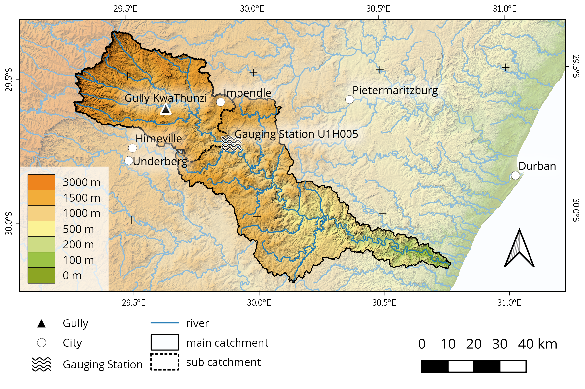
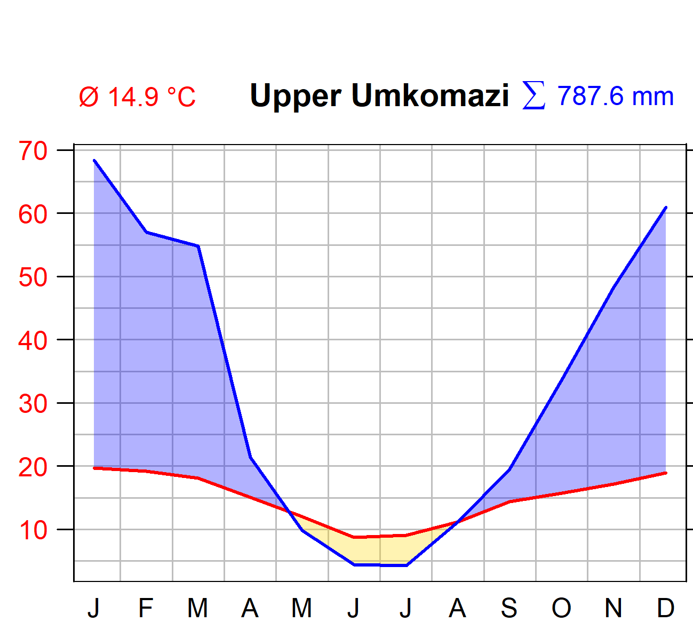

# dimgul-input
Pre-process input variables for the DIMGUL gully erosion model by A. Sidorchuk.

## Scripts

- [Soil parameter](https://www.sommergeo.com/dimgul-input/docs/soil_parameter_preparation.html): Calculate the soil parameters for multiple layers from soil texture and field measurements.
- [Runoff simulation](https://www.sommergeo.com/dimgul-input/docs/runoff_endless_experiment.html): Simulate a long-term surface runoff dataset based on empirical data.

## Example data
Gully KwaThunzi is situated in the Upper Umkomazi catchment and part of the subcatchment draining into gauging station [U1H005](http://www.dwa.gov.za/hydrology/Verified/HyImage.aspx?Station=U1H005).

The climate data were aggregated from the [CRU-TS](http://www.cru.uea.ac.uk/data) v4.03 dataset.

## References
Sidorchuk, A. (1999). "Dynamic and static models of gully erosion." CATENA 37(3): 401-414.