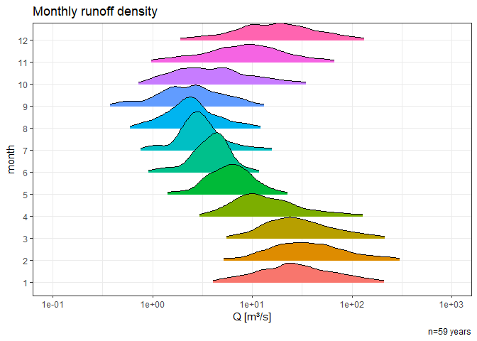

Content
=======

This is a an R script to simulate a runoff time-series based on
empirical data for the DIMGUL gully model by Alexey Sidorchuk (1998,
1999). In a first step, observed flow data are transformed and a
temporaly variable gaussian function is derived. In a second step,
random values are derived from this function in a reproducible manner,
in order to simulate a long-term time-series, which resembles the
natural conditions, whille providing data, where no observations are
available. The simulated time-series reflects the conditions of the
observed data, *without effects like climate change or land use / land
cover change, etc*. In the third step, we calculate hydrological values
like area specific runoff q and runoff height R. In the last step, data
are exportet in a structered text file, which is ready-to-use with the
DIMGUL implementation.

Units
-----

| Name                                 | Abbr | Unit      |
|--------------------------------------|------|-----------|
| Discharge                            | Q    | m³/s      |
| logarithmic Discharge                | Qlog | log(m³/s) |
| area specific runoff “Abflussspende” | q    | l/(m²s)   |
| daily runoff height “Abflusshöhe”    | R    | mm/day    |
| subcatchment area                    | A    | km²       |

Calculation
===========

Data import and preparation
---------------------------

Import the runoff dataset 1960-2018 of the Umkomazi gauging station (ID:
U1H005) available at the [South African Department of Water
Affairs](http://www.dwa.gov.za/hydrology/Verified/HyDataSets.aspx?Station=U1H005).
The runoff Q is in unit \[m³/s\].

``` r
runoff <- read_table2("../data/U1H005_daily.txt", 
                      col_types = cols(DATE = col_integer()), 
                      skip = 10)
```

    ## # A tibble: 3 x 3
    ##       DATE     Q  QUAL
    ##      <int> <dbl> <dbl>
    ## 1 19600901  2.61     1
    ## 2 19600902  2.58     1
    ## 3 19600903  2.56     1

We clean the data and set column formats. The quality code indicates the
validity of each observation and is available
[here](http://www.dwa.gov.za/hydrology/Verified/HyCodes.aspx). Then, we
derive seperate columns for ‘year’ and ‘doy’(day-of-year) for each
observation with the package
[Lubridate](https://lubridate.tidyverse.org)

``` r
runoff[is.na(runoff$QUAL),2] <- NA # remove Quality measures that shifted in the Q column
runoff <- ts.format(runoff, format="%Y%m%d", cols=c(1,2)) # set date format
runoff$year <- as.integer(substr(runoff$Date, 1,4)) # derive year
runoff$doy <- as.numeric(strftime(runoff$Date, format = "%j"))  # derive day-of-year
runoff$month <- as.numeric(strftime(runoff$Date, format = "%m"))  # derive day-of-year
runoff <- na.omit(runoff) # delete empty fields
```

As a result, we get this table…

    ## # A tibble: 3 x 6
    ##   Date                    Q  QUAL  year   doy month
    ##   <dttm>              <dbl> <dbl> <int> <dbl> <dbl>
    ## 1 1960-09-01 00:00:00  2.61     1  1960   245     9
    ## 2 1960-09-02 00:00:00  2.58     1  1960   246     9
    ## 3 1960-09-03 00:00:00  2.56     1  1960   247     9

… and this continuous dataset of the runoff at the gauging station.


Runoff transformation and aggregation
-------------------------------------

We transform the discharge by a base 10 logarithm.

``` r
runoff$Qlog <- log10(runoff$Q)  # calculate Log base 10 of runoff
runoff <- runoff[!(runoff$Qlog=='-Inf'),] # delete -Inf
```

    ## # A tibble: 3 x 7
    ##   Date                    Q  QUAL  year   doy month  Qlog
    ##   <dttm>              <dbl> <dbl> <int> <dbl> <dbl> <dbl>
    ## 1 1960-09-01 00:00:00  2.61     1  1960   245     9 0.416
    ## 2 1960-09-02 00:00:00  2.58     1  1960   246     9 0.412
    ## 3 1960-09-03 00:00:00  2.56     1  1960   247     9 0.408


If we plot all of a day-of-year’s discharges, which were measured over
the time series, we notice that they follow a normal distribution, when
plotted on a logarithmic scale.



Therefore, we can aptly describe daily runoff patterns through the
calculation of mean and standard deviation for each individual
day-of-year.

``` r
#Create empty data frame
runoff_aggregates <- data.frame()

#aggregate mean runoff per day
runoff_aggregates <- aggregate(runoff, by=list(runoff$doy), FUN=mean)[,c('doy','Qlog')]

#aggregate mean runoff per day
runoff_aggregates$sd <- aggregate(runoff, list(runoff$doy), FUN=sd)[,c('Qlog')]

names(runoff_aggregates) <- c('doy','mean','sd')
```

Runoff simulation
-----------------

Now, We simulate expected runoff for each day of any given timeseries,
in this example for the range 1500–2018. We create randomized values,
based on the observed annual discharge distribution, which was derived
from the time series 1960-2018. The random values are derived through a
gaussian function from the observed mean and standard deviation.

``` r
set.seed(2020)
# Manual input of desired time span
start_year <- 1500
end_year <- 2018
number_of_years <- end_year-start_year
runoff_pred <- data.frame()

# Simulation
for(i in runoff_aggregates$doy){
  x <- rnorm(number_of_years, mean=runoff_aggregates$mean[i], sd=runoff_aggregates$sd[i])
  pred <- data.frame(cbind(seq(start_year,end_year,1), # year
                         rep(i, number_of_years),      # doy
                         x))                           # predicted values
  runoff_pred <- rbind(runoff_pred, pred)
}
names(runoff_pred) <- c('year','doy','Qlog')

# Filter gap years
runoff_pred <- runoff_pred[!(runoff_pred$doy==366 & leap_year(runoff_pred$year)==TRUE),]
```

Here is the resulting distribution of daily discharges. The similarity
with the previous illustration of observed data is obvious.


Backtransformation of the logarithmic runoffs to regular Q \[m³/s\]

``` r
runoff_pred$Q <- 10^runoff_pred$Qlog
```

Calculation of area specific runoff and runoff height
-----------------------------------------------------

Until here, we were dealing with runoff values of the gauging station.
Now we relate the results to the entire subcatchment area. Therefore, we
calculate the **area specific runoff (q)** after Baumgartner & Liebscher
(1996: eq. 14.1, p. 475) and Casper & Bormann (2016: eq. 8.4, p. 128)
using with Q = runoff at the gauging station \[m³/s\] and A =
subcatchment area of the gauging station \[km²\]. The area specific
runoff q is in \[l/(km²s)\].

``` r
catchment_area <- 1744 # area in [km²]
runoff_pred$q <- runoff_pred$Q*1000/catchment_area # Q [m³/s] to [l/s]
```

We also calculate the accumulated **runoff R** for each day in \[mm/d\]
after Baumgartner & Liebscher (1996: eq. 14.2, p. 475) with t = time in
\[s\]

``` r
runoff_pred$R <- runoff_pred$q * 86400 / 10^6 # per day
```

Order rows by year and day-of-year

``` r
runoff_pred <- runoff_pred[order(runoff_pred$year, runoff_pred$doy),]
```

This is the resulting table with simulated runoff in the differen
formats Q \[m³/s\], q \[l/(m²s)\] and R \[mm/d\]:

    ##      year doy     Qlog        Q        q         R
    ## 1    1500   1 1.449944 28.18022 16.15838 1.3960842
    ## 520  1500   2 1.339125 21.83357 12.51925 1.0816632
    ## 1039 1500   3 1.854591 71.54699 41.02465 3.5445300
    ## 1558 1500   4 1.665231 46.26271 26.52679 2.2919143
    ## 2077 1500   5 1.247821 17.69381 10.14553 0.8765739
    ## 2596 1500   6 1.669091 46.67577 26.76363 2.3123776

File Export
===========

Finally, we export the simulated data to a structured file with the two
columns ‘year’ and runoff (‘q’ or ‘R’), which is ready to use with the
gully model. Note that we convert q from unit \[l/(km²s)\] to
\[l/(m²s)\] for compability reasons.

``` r
# Export q in [l/(km²s)]
out <- runoff_pred[,c("year", "q")]
out$q <- out$q/1000000 # [l/(km²s)] to [l/(m²s)]
out$q <- format(out$q, scientific = FALSE) # change to decimals
write.table(out, "../output/S_150_lts_q.txt", sep="\t", row.names=F, col.names=F, quote=F)

# Export h in [mm/d]
out <- runoff_pred[,c("year", "R")] 
out$R <- format(out$R, scientific = FALSE) # change to decimals
write.table(out, "../output/S_150_lts_R.txt", sep="\t", row.names=F, col.names=F, quote=F)
```

Useful Links
============

-   <https://www.bauformeln.de/einheiten-rechner/niederschlagsintensitaet-und-abflussspende/>

References
==========

BAUMGARTNER, A. & LIEBSCHER, H. J. 1996. Lehrbuch der Hydrologie, Band
1: Allgemeine Hydologie, Quantitative Hydrologie, Stuttgart, Germany,
Schweizerbarth.

CASPER, M. & BORMANN, H. 2016. Abfluss im Gewässersystem. In: FÖHRER,
N., BORMANN, H., MIEGEL, K., CASPER, M., BRONSTERT, A., SCHUMANN, A. &
WEILER, M. (eds.) Hydrologie. Bern, Switzerland: Haupt.

SIDORCHUK, A. & SIDORCHUK, A. (1998). Model for estimating gully
morphology Modelling Soil Erosion, Sediment Transport and Closely
Related Hydrological Processes, Vienna.

SIDORCHUK, A. (1999). “Dynamic and static models of gully erosion.”
CATENA 37(3): 401-414.
