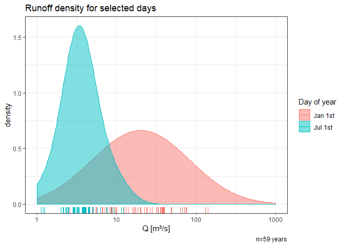

# KwaThunzi runoff time-series simulation
## Content

This is a an R script to simulate a runoff time-series based on
empirical data for the DYNGUL gully model by Alexey Sidorchuk (1998,
1999). In a first step, observed runoff data are transformed and a
temporaly variable gaussian function is derived. In a second step,
random values are created from this function in a reproducible manner,
to create a simulated long-term time series, which resembles the natural
conditions. The simulated time-series reflects the conditions of the
observed data, *without effects like climate change or land use / land
cover change, etc*. In the final step, data are

### Units

| Name                            | Abbr | Unit                 |
|---------------------------------|------|----------------------|
| runoff                          | Q    | m³/s                 |
| logarithmic runoff              | Qlog | log(m³/s)            |
| area specific runoff            | q    | l/(m²s)              |
| accumulated daily runoff height | qacc | mm/m² = l/m² per day |

## Calculation

### Data import and preparation

Import the runoff dataset 1960-2018 of the Umkomazi gauging station (ID:
U1H005) available at the [South African Department of Water
Affairs](http://www.dwa.gov.za/hydrology/Verified/HyDataSets.aspx?Station=U1H005).
The runoff Q is in unit \[m³/s\].

``` r
runoff <- read_table2("../data/U1H005_daily.txt", 
                      col_types = cols(DATE = col_integer()), 
                      skip = 10)
```

    ## # A tibble: 3 x 3
    ##       DATE     Q  QUAL
    ##      <int> <dbl> <dbl>
    ## 1 19600901  2.61     1
    ## 2 19600902  2.58     1
    ## 3 19600903  2.56     1

Clean the data and set column formats. The quality code indicates the
validity of each observation and is available
[here](http://www.dwa.gov.za/hydrology/Verified/HyCodes.aspx). Derive
seperate columns for ‘year’ and ‘doy’(day-of-year) for each observation.

``` r
runoff[is.na(runoff$QUAL),2] <- NA # remove Quality measures that shifted in the Q column
runoff <- ts.format(runoff, format="%Y%m%d", cols=c(1,2)) # set date format
runoff$year <- as.integer(substr(runoff$Date, 1,4)) # derive year
runoff$doy <- as.numeric(strftime(runoff$Date, format = "%j"))  # derive day-of-year
runoff <- na.omit(runoff) # delete empty fields
```

    ## # A tibble: 3 x 5
    ##   Date                    Q  QUAL  year   doy
    ##   <dttm>              <dbl> <dbl> <int> <dbl>
    ## 1 1960-09-01 00:00:00  2.61     1  1960   245
    ## 2 1960-09-02 00:00:00  2.58     1  1960   246
    ## 3 1960-09-03 00:00:00  2.56     1  1960   247


### Runoff transformation and aggregation

Transform discharge by base 10 logarithm.

``` r
runoff$Qlog <- log10(runoff$Q)  # calculate Log base 10 of runoff
runoff <- runoff[!(runoff$Qlog=='-Inf'),] # delete -Inf
```

    ## # A tibble: 3 x 6
    ##   Date                    Q  QUAL  year   doy  Qlog
    ##   <dttm>              <dbl> <dbl> <int> <dbl> <dbl>
    ## 1 1960-09-01 00:00:00  2.61     1  1960   245 0.416
    ## 2 1960-09-02 00:00:00  2.58     1  1960   246 0.412
    ## 3 1960-09-03 00:00:00  2.56     1  1960   247 0.408


If you plot all of a day-of-year’s discharges, which were measured over
the time series, you’ll notice that they follow a normal distribution,
when plotted on a logarithmic scale.



Therefore, we can describe daily runoff patterns, if we calculate daily
mean and standard deviation for each day-of-year.

``` r
#Create empty data frame
runoff_aggregates <- data.frame()

#aggregate mean runoff per day
runoff_aggregates <- aggregate(runoff, by=list(runoff$doy), FUN=mean)[,c('doy','Qlog')]

#aggregate mean runoff per day
runoff_aggregates$sd <- aggregate(runoff, list(runoff$doy), FUN=sd)[,c('Qlog')]

names(runoff_aggregates) <- c('doy','mean','sd')
```

### Runoff simulation

We simulate expected runoff of each day of any given timeseries, in this
example for the range 1500–2018. We create randomized values, based on
the observed annual discharge distribution, which was derived from the
time series 1960-2018. The random values are derived through a gaussian
function from the observed mean and standard deviation.

``` r
set.seed(2020)
# Manual input of desired time span
start_year <- 1500
end_year <- 2018
number_of_years <- end_year-start_year
runoff_pred <- data.frame()

# Simulation
for(i in runoff_aggregates$doy){
  x <- rnorm(number_of_years, mean=runoff_aggregates$mean[i], sd=runoff_aggregates$sd[i])
  pred <- data.frame(cbind(seq(start_year,end_year,1), # year
                         rep(i, number_of_years),      # doy
                         x))                           # predicted values
  runoff_pred <- rbind(runoff_pred, pred)
}
names(runoff_pred) <- c('year','doy','Qlog')

# Filter gap years
runoff_pred <- runoff_pred[!(runoff_pred$doy==366 & leap_year(runoff_pred$year)==TRUE),]
```


Backtransformation of the logarithmic runoffs to regular Q \[m³/s\]

``` r
runoff_pred$Q <- 10^runoff_pred$Qlog
```

### Calculation of area specific runoff

Calculate area specific runoff (q) after Baumgartner and Liebscher
(1996) and Casper and Bormann (2016) using with Q = runoff at the
gauging station and A = catchment area

``` r
catchment_area <- 1744 * 1000000 # area in [m²]
runoff_pred$q <- runoff_pred$Q/catchment_area
```

We also calculate the accumulated runoff for each day in \[mm/m²\].

``` r
runoff_pred$qacc <- runoff_pred$q * 86400 # multiply with secons per day
```

Order rows by year and day-of-year

``` r
runoff_pred <- runoff_pred[order(runoff_pred$year, runoff_pred$doy),]
```

This is the resulting table with simulated runoff in the differen
Formats Q \[m³/s\], q \[l/(m²s)\] and qacc \[mm/\]:

    ##      year doy     Qlog        Q            q         qacc
    ## 1    1500   1 1.449944 28.18022 1.615838e-08 0.0013960842
    ## 520  1500   2 1.339125 21.83357 1.251925e-08 0.0010816632
    ## 1039 1500   3 1.854591 71.54699 4.102465e-08 0.0035445300
    ## 1558 1500   4 1.665231 46.26271 2.652679e-08 0.0022919143
    ## 2077 1500   5 1.247821 17.69381 1.014553e-08 0.0008765739
    ## 2596 1500   6 1.669091 46.67577 2.676363e-08 0.0023123776

### File Export

Export simulated data to a structured file with the two columns ‘year’
and runoff (‘q’ or ‘qacc’), which is ready to use with the gully model

``` r
# Export in [l/(m²s)]
out <- runoff_pred[,c("year", "q")] 
out$q <- format(out$q, scientific = FALSE) # change to decimals
write.table(out, "../output/S_150_lts_lm2s.txt", sep="\t", row.names=F, col.names=F, quote=F)
# Export in [mm]
out <- runoff_pred[,c("year", "qacc")] 
out$qacc <- format(out$qacc, scientific = FALSE) # change to decimals
write.table(out, "../output/S_150_lts_mm.txt", sep="\t", row.names=F, col.names=F, quote=F)
```

References
----------

BAUMGARTNER, A. & LIEBSCHER, H. J. 1996. Lehrbuch der Hydrologie, Band
1: Allgemeine Hydologie, Quantitative Hydrologie, Stuttgart, Germany,
Schweizerbarth.

CASPER, M. & BORMANN, H. 2016. Abfluss im Gewässersystem. In: FÖHRER,
N., BORMANN, H., MIEGEL, K., CASPER, M., BRONSTERT, A., SCHUMANN, A. &
WEILER, M. (eds.) Hydrologie. Bern, Switzerland: Haupt.

SIDORCHUK, A. & SIDORCHUK, A. (1998). Model for estimating gully
morphology Modelling Soil Erosion, Sediment Transport and Closely
Related Hydrological Processes, Vienna.

SIDORCHUK, A. (1999). “Dynamic and static models of gully erosion.”
CATENA 37(3): 401-414.
